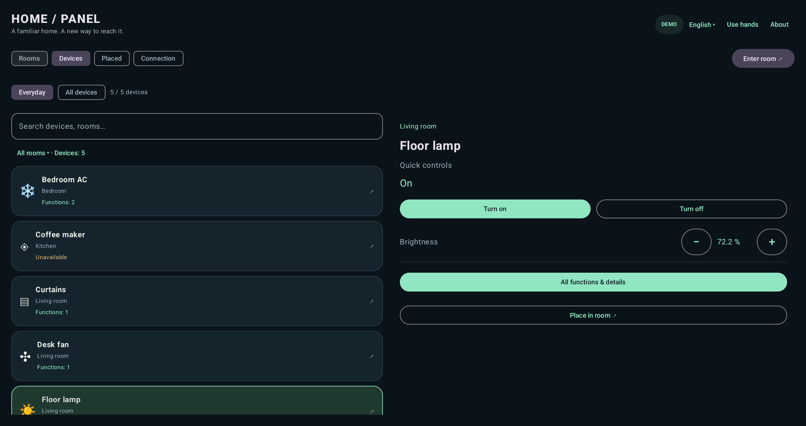

# HomePanel MR

[English](README.md) · [Báo lỗi / đề xuất](https://github.com/hohiep102/homepanel-mr/issues/new/choose) · [Đóng góp PR](CONTRIBUTING.md)

Ứng dụng Home Assistant trong mixed reality dành cho Meta Quest 3/3S: xem thiết bị theo phòng, đặt bảng điều khiển cạnh đồ vật và dùng tay tương tác trong passthrough. Controller là lựa chọn phụ.



Ảnh trên là dashboard Android với dữ liệu demo, không phải bằng chứng tracking trên kính hoặc điều khiển thiết bị thật.

## Hai bản trong một repo

- **Community:** miễn phí, tự build/cài ngoài Store, không cần quyền mua Meta.
- **Store:** cùng tính năng HA/MR, có kiểm tra quyền sở hữu Meta.

Hai bản dùng chung phần lớn mã nguồn nhưng có package, chữ ký và dữ liệu riêng. Các bản debug cũng có danh tính riêng. Chuyển từ beta cũ hoặc giữa các bản cần đăng nhập/gán vị trí lại. Chi tiết trong [Distributions](docs/DISTRIBUTIONS.md).

Source hiện tại là **1.0.1**. Hồ sơ Store đầu tiên đang chờ duyệt tính đến ngày 04/10/2026; chưa coi đây là xác nhận mở bán. Các kiểm thử tự động của việc tách bản đã qua; vẫn cần nghiệm thu MR trên chính các APK ký phát hành 1.0.1.

## Tính năng

- Tìm HA trong LAN, nhập URL thủ công và đăng nhập bằng trình duyệt; access token là lựa chọn nâng cao.
- Xem phòng, thiết bị và nhiều chức năng/kênh; mặc định ẩn entity cấu hình/chẩn đoán khỏi danh sách hằng ngày.
- Điều khiển đèn, công tắc, climate, quạt và rèm tùy khả năng integration HA.
- Gán vị trí theo entity và room anchor; giao diện tiếng Anh/Việt; có demo không cần HA.

MR hoạt động khi HomePanel đang mở. Chưa có overlay thường trực trên ứng dụng khác, nhận diện vật thể bằng AI hoặc theo dõi đồ vật đã di chuyển.

## Build và cài Community

Cài JDK 17, Android SDK Platform 36 và Build Tools 36.0.0. Đặt `JAVA_HOME`, `ANDROID_HOME` hoặc cấu hình `sdk.dir` trong `local.properties` (không commit file này).

```sh
git clone https://github.com/hohiep102/homepanel-mr.git
cd homepanel-mr
./scripts/build.sh
./scripts/install-quest.sh community debug
```

Script cài đặt yêu cầu đúng một Quest 3/3S đã bật Developer Mode và cho phép USB debugging. APK ở `app/build/outputs/apk/community/debug/app-community-debug.apk`. Mở **HomePanel MR Community Debug** rồi chọn **Khám phá demo** hoặc **Kết nối**. Windows có thể dùng Android Studio hoặc `gradlew.bat :app:testCommunityDebugUnitTest :app:assembleCommunityDebug`.

Đặt kính và HA trong mạng có thể kết nối với nhau, chọn server trong màn Kết nối, đăng nhập trên trang HA rồi quay lại app. HTTPS vẫn kiểm tra chứng chỉ/hostname; HTTP LAN được hỗ trợ nhưng không mã hóa đường truyền. Phiên HA được lưu mã hóa bằng Android Keystore và không tự chia sẻ giữa các bản.

## Góp ý và đóng góp

Bạn có thể viết issue và PR bằng tiếng Việt hoặc tiếng Anh. Dùng [mẫu issue](https://github.com/hohiep102/homepanel-mr/issues/new/choose) để báo lỗi/đề xuất; fork repo, tạo branch và mở PR vào `main` để đóng góp code. Xem [hướng dẫn đóng góp](CONTRIBUTING.md).

CI chạy build, unit tests và lint cho cả hai bản; không dùng khóa ký của nhà phát hành hay tài khoản HA thật. Bộ instrumentation chỉ chạy trên emulator hoặc thiết bị thử nghiệm riêng vì fixture có thể xóa dữ liệu app. Kết quả và giới hạn: [Testing](docs/TESTING.md), [nghiệm thu trên kính](docs/HAND_TESTING.md).

## Giấy phép

Mã HomePanel tự viết dùng [Apache-2.0](LICENSE). Các SDK/phụ thuộc giữ giấy phép riêng, gồm các điều khoản SDK của Meta; xem [NOTICE](NOTICE) và mục Thông tin → Giấy phép bên thứ ba trong app. HomePanel là dự án độc lập, không được Open Home Foundation hoặc Meta bảo trợ.

Không đưa token, mật khẩu, địa chỉ server riêng hoặc ảnh phòng cá nhân lên issue/PR. Báo lỗ hổng qua [kênh bảo mật riêng](SECURITY.md).
